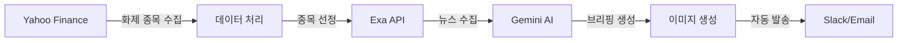

# 당신이 잠든 사이 (While You Were Sleeping)


미국주식 투자하는 한국인 직장인을 위한 **완전 자동화된 데일리 브리핑 서비스**입니다.

## 🌟 핵심 기능

### 자동화된 워크플로우
1. **화제 종목 자동 선정** - Yahoo Finance의 거래량과 상승률 데이터 분석
2. **뉴스 수집 및 요약** - Exa API로 관련 뉴스 수집, Gemini AI로 요약
3. **AI 브리핑 생성** - 텍스트와 이미지 브리핑 자동 생성
4. **자동 발송** - 매일 아침 7시 슬랙/이메일로 자동 발송

### 대시보드
- 📊 오늘의 화제 종목 TOP 5
- 📈 실시간 주가 차트
- 📝 브리핑 히스토리
- 🌙 다크/라이트 모드 지원
- 📱 완전 반응형 디자인

## 🚀 빠른 시작

### 사전 요구사항
- Node.js 18.x 이상
- Python 3.9 이상
- API 키:
  - [Google Gemini API](https://makersuite.google.com/app/apikey)
  - [Exa API](https://exa.ai)
  - [Slack Webhook](https://api.slack.com/messaging/webhooks) (선택)

### 설치 및 실행

```bash
# 1. 저장소 클론
git clone <repository-url>
cd ica-project

# 2. 백엔드 설정
cd backend
pip install -r requirements.txt

# 환경 변수 설정 (backend/.env)
echo "GEMINI_API_KEY=your_key" > .env
echo "EXA_API_KEY=your_key" >> .env
echo "SLACK_WEBHOOK_URL=your_url" >> .env

# 3. 프론트엔드 설정
cd ..
npm install

# 4. 실행
npm run dev                           # 프론트엔드 (http://localhost:3000)
python backend/scheduler.py --run-once # 백엔드 테스트
```

자세한 내용은 [QUICK_START_개선.md](./QUICK_START_개선.md)를 참고하세요.

## 📁 프로젝트 구조

```
ica-project/
├── backend/                    # Python 백엔드
│   ├── get_trending_stocks.py  # 화제 종목 수집
│   ├── exa_news.py            # 뉴스 수집
│   ├── gemini_briefing.py     # AI 브리핑 생성
│   ├── daily_briefing_workflow.py # 워크플로우 통합
│   ├── scheduler.py           # 자동화 스케줄러
│   └── requirements.txt       # Python 의존성
├── components/                # React 컴포넌트
│   ├── Layout.tsx
│   ├── StockCard.tsx
│   ├── BriefingCard.tsx
│   └── ThemeToggle.tsx
├── pages/                     # Next.js 페이지
│   ├── _app.tsx              # 앱 진입점
│   ├── index.tsx             # 대시보드
│   └── briefings/[id].tsx    # 브리핑 상세
├── contexts/                  # React Context
│   └── ThemeContext.tsx      # 테마 관리
├── lib/                      # 유틸리티
│   └── mockData.ts           # 목업 데이터
└── 개발일지/                  # 개발 기록
```

## 🛠 기술 스택

### 백엔드
- **Python 3.9+** - 메인 언어
- **Yahoo Finance (yahooquery)** - 주식 데이터
- **Exa API** - 뉴스 검색
- **Google Gemini API** - AI 브리핑 생성
- **APScheduler** - 작업 스케줄링
- **Pillow** - 이미지 생성

### 프론트엔드
- **Next.js 14** - React 프레임워크
- **TypeScript** - 타입 안전성
- **TailwindCSS** - 스타일링
- **Recharts** - 차트 라이브러리

## 📊 워크플로우



## 🎯 주요 특징

### 1. 완전 자동화 (Chatless)
- 사용자 입력 없이 자동으로 작동
- 매일 아침 7시 자동 실행
- 화제 종목 자동 선정

### 2. AI 기반 분석
- Google Gemini를 활용한 뉴스 요약
- 종목 분석 및 화제 원인 파악
- 이미지 브리핑 자동 생성

### 3. 사용자 친화적 대시보드
- 직관적인 UI/UX
- 다크/라이트 모드 지원
- 모바일 최적화

## 📖 문서

- [빠른 시작 가이드](./QUICK_START_개선.md)
- [프로젝트 점검 보고서](./프로젝트_점검_보고서.md)
- [서비스 기획서](./서비스기획서_당신이잠든사이.md)
- [REST API 명세서](./REST_API_명세서.md)
- [개발일지](./개발일지/)

## 🧪 테스트

```bash
# 백엔드 테스트
cd backend
python test_stocks.py      # 화제 종목 수집 테스트
python test_exa.py          # 뉴스 수집 테스트
python test_gemini.py       # Gemini API 테스트

# 프론트엔드 테스트
npm run lint               # 린트 검사
npm run build              # 빌드 테스트
```

## 🚢 배포

### 프론트엔드 (Vercel 권장)
```bash
npm run build
npm start
```

### 백엔드 (서버 또는 클라우드)
```bash
# 스케줄러 실행 (백그라운드)
nohup python backend/scheduler.py &
```

## 🤝 기여

이 프로젝트는 ICA AI 특강의 일환으로 개발되었습니다.

## 📝 라이선스

MIT License - 자유롭게 사용하고 수정할 수 있습니다.

## 🔗 관련 링크

- [Google Gemini API](https://ai.google.dev/)
- [Exa API](https://exa.ai/)
- [Yahoo Finance](https://finance.yahoo.com/)
- [Next.js 문서](https://nextjs.org/docs)

## 📧 문의

프로젝트에 대한 문의사항이 있으시면 이슈를 등록해주세요.

---

**Made with ❤️ for Korean investors in US stocks**


